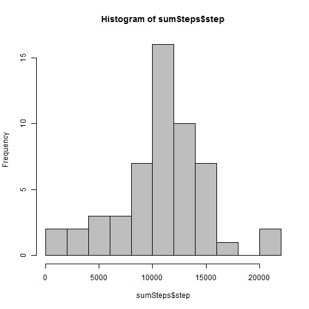
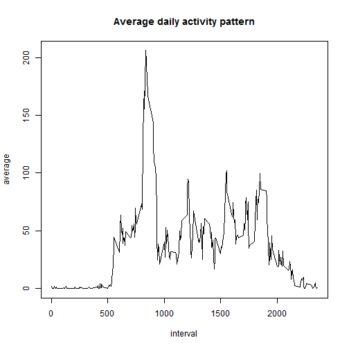
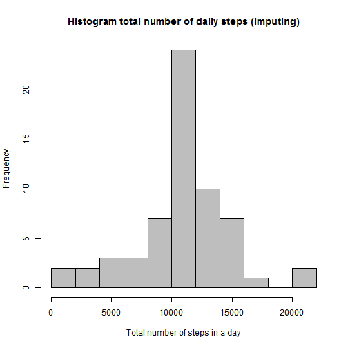
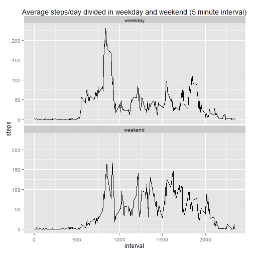

This assignment makes use of data from a personal activity monitoring device. This device collects
data at 5 minute intervals through out the day. The data consists of two months of data from an 
anonymous individual collected during the months of October and November, 2012 and include the 
number of steps taken in 5 minute intervals each day.  

####Loading and preprocessing the data


```r
setwd("C:/Users/JORGE/Desktop/coursera R/Reproducible Research")
data<-read.csv("activity.csv", header=TRUE, stringsAsFactors = FALSE)
str(data)
```

```
## 'data.frame':	17568 obs. of  3 variables:
##  $ steps   : int  NA NA NA NA NA NA NA NA NA NA ...
##  $ date    : chr  "2012-10-01" "2012-10-01" "2012-10-01" "2012-10-01" ...
##  $ interval: int  0 5 10 15 20 25 30 35 40 45 ...
```

```r
data$date<-as.Date(data$date)
head(data)
```

```
##   steps       date interval
## 1    NA 2012-10-01        0
## 2    NA 2012-10-01        5
## 3    NA 2012-10-01       10
## 4    NA 2012-10-01       15
## 5    NA 2012-10-01       20
## 6    NA 2012-10-01       25
```

####What is mean total number of steps taken per day?


```r
library("dplyr", lib.loc="~/R/win-library/3.1")
```


```r
sumSteps<-sumSteps<-aggregate(steps ~ date, data = data, FUN = sum)
        
hist(sumSteps$step,col=8, breaks=10)
```

 

```r
summary(sumSteps)
```

```
##       date                steps      
##  Min.   :2012-10-02   Min.   :   41  
##  1st Qu.:2012-10-16   1st Qu.: 8841  
##  Median :2012-10-29   Median :10765  
##  Mean   :2012-10-30   Mean   :10766  
##  3rd Qu.:2012-11-16   3rd Qu.:13294  
##  Max.   :2012-11-29   Max.   :21194
```

```r
round(mean(sumSteps$step),digits=0)
```

```
## [1] 10766
```

```r
round(median(sumSteps$step), digits=0)
```

```
## [1] 10765
```
The mean and median reported above is **10766** and **10765**


####What is the average daily activity pattern?

Make a time series plot (i.e. type = "l") of the 5-minute interval (x-axis) and the average number
of steps taken, averaged across all days (y-axis)
Which 5-minute interval, on average across all the days in the dataset, contains the maximum 
of steps?


```r
intervalgroup<-data%>%
        group_by(interval)%>%
        summarise(average=(mean(steps, na.rm=TRUE)))
plot(intervalgroup, type="l", main="Average daily activity pattern")
```

 

```r
maxAverage<-intervalgroup%>%
        filter(average==max(average))
maxAverage$interval
```

```
## [1] 835
```
The interval with the maximun average number of steps is **835**

####Imputing missing values

Note that there are a number of days/intervals where there are missing values (coded as NA). 
The presence of missing days may introduce bias into some calculations or summaries of the data.

1. Calculate and report the total number of missing values in the 
dataset (i.e. the total number of rows with NAs)


```r
missingValues<-data%>%
        filter(is.na(steps))
length(missingValues$steps)
```

```
## [1] 2304
```

The total number of missing values is **2304**

2. Devise a strategy for filling in all of the missing values in the dataset. The strategy does not 
need to be sophisticated. For example, you could use the mean/median for that day, or the mean for 
that 5-minute interval, etc.  
  


```r
# find the mean for the 5 minute interval 
intervalMean<-data%>%
        group_by(interval)%>%
        summarise(Mean=round(mean(steps,na.rm=TRUE),digits=0))
head(intervalMean)
```

```
## Source: local data frame [6 x 2]
## 
##   interval Mean
## 1        0    2
## 2        5    0
## 3       10    0
## 4       15    0
## 5       20    0
## 6       25    2
```


3. Create a new dataset that is equal to the original dataset but with the missing data filled in.

```r
dataFilled<-data
for (i in 1:length(dataFilled$steps)) {
        if(is.na(dataFilled$steps[i])) {dataFilled$steps[i]<-(filter(intervalMean, 
                                                         interval==dataFilled$interval[i]))$Mean}
}
head(dataFilled)
```

```
##   steps       date interval
## 1     2 2012-10-01        0
## 2     0 2012-10-01        5
## 3     0 2012-10-01       10
## 4     0 2012-10-01       15
## 5     0 2012-10-01       20
## 6     2 2012-10-01       25
```

4. Make a histogram of the total number of steps taken each day and Calculate and report the mean
and median total number of steps taken per day. Do these values differ from the estimates from the
first part of the assignment? What is the impact of imputing missing data on the estimates of the 
total daily number of steps?


```r
sumSteps<-dataFilled%>%
        group_by(date)%>%
        summarise(stepSum=sum(steps,na.rm=TRUE))

hist(sumSteps$stepSum, col=8,breaks=10, main="Histogram total number of daily steps (imputing)", 
     xlab="Total number of steps in a day")
```

 

```r
summary(sumSteps)
```

```
##       date               stepSum     
##  Min.   :2012-10-01   Min.   :   41  
##  1st Qu.:2012-10-16   1st Qu.: 9819  
##  Median :2012-10-31   Median :10762  
##  Mean   :2012-10-31   Mean   :10766  
##  3rd Qu.:2012-11-15   3rd Qu.:12811  
##  Max.   :2012-11-30   Max.   :21194
```

```r
round(mean(sumSteps$stepSum),digits=0)
```

```
## [1] 10766
```

```r
round(median(sumSteps$stepSum), digits=0)
```

```
## [1] 10762
```
There is a  little change in the median


####Are there differences in activity patterns between weekdays and weekends?

For this part the weekdays() function may be of some help here. Use the dataset with the filled-in 
missing values for this part.

1. Create a new factor variable in the dataset with two levels - "weekday" and "weekend" 
indicating whether a given date is a weekday or weekend day.


```r
n<-length(dataFilled$date)
typeDay<-ifelse(weekdays(dataFilled$date)=="sábado"|weekdays(dataFilled$date)=="domingo",
                "weekend","weekday")
typeDay<-as.factor(typeDay)

dataFactor<-dataFilled%>%
        mutate(typeDay)
head(dataFactor)
```

```
##   steps       date interval typeDay
## 1     2 2012-10-01        0 weekday
## 2     0 2012-10-01        5 weekday
## 3     0 2012-10-01       10 weekday
## 4     0 2012-10-01       15 weekday
## 5     0 2012-10-01       20 weekday
## 6     2 2012-10-01       25 weekday
```

2. Make a panel plot containing a time series plot (i.e. type = "l") of the 5-minute interval 
(x-axis) and the average number of steps taken, averaged across all weekday days or weekend days 
(y-axis). See the README file in the GitHub repository to see an example of what this plot should 
look like using simulated data.


```r
library("ggplot2")
```

```
## Warning: package 'ggplot2' was built under R version 3.1.2
```


```r
dataMeanFactor<-dataFactor%>%
        group_by(interval,typeDay)%>%
        summarise(steps=mean(steps))


g<-qplot(interval,steps, data=dataMeanFactor, geom =  c("line"), ylab= "steps")
g + facet_wrap(~typeDay,nrow=2)+labs(title="Average steps/day divided in weekday and weekend (5 minute interval)")
```

 
